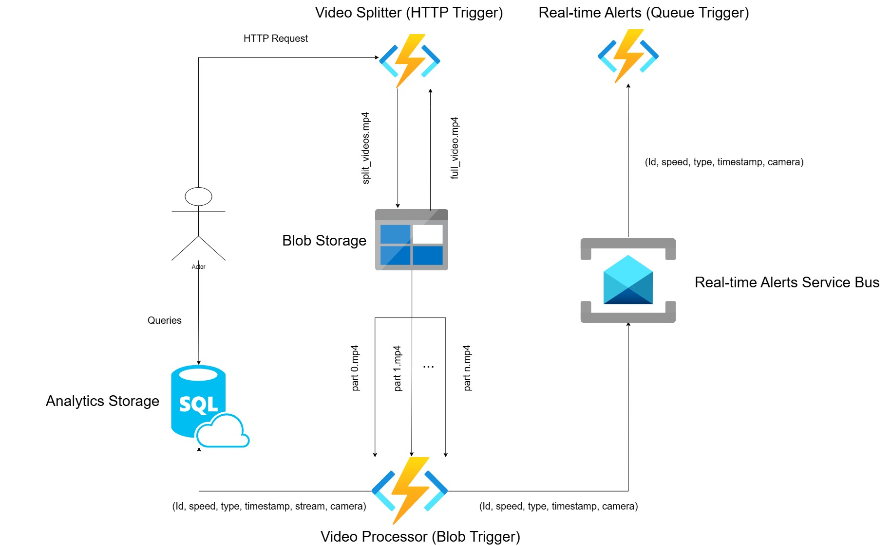

# Real-Time Traffic Monitoring System  
Cloud-Based Distributed Video Analytics (Azure + YOLOv8)

A distributed, event-driven traffic monitoring pipeline built on Azure Functions.  
The system performs automated vehicle detection, tracking and speed estimation using YOLOv8, stores structured analytics in Azure SQL, and triggers real-time alerts via Service Bus.

---

## System Architecture

The system follows an event-driven cloud architecture:

1. HTTP Trigger — Video Splitter  
   - Splits raw traffic video into 2-minute segments (FFmpeg)
   - Stores segments in Azure Blob Storage

2. Blob Trigger — Video Processor  
   - Loads YOLOv8 (Ultralytics)
   - Performs multi-object tracking (persistent IDs)
   - Computes speed using ROI-based real-world calibration
   - Separates inbound / outbound lanes
   - Inserts structured results into Azure SQL
   - Publishes overspeed events to Azure Service Bus

3. Service Bus Trigger — Real-Time Alerts  
   - Consumes overspeed events
   - Generates alert logs / notifications

---

## Computer Vision Module

Vehicle detection and speed estimation implemented using:

- YOLOv8 (Ultralytics)
- Persistent multi-object tracking
- ROI-based speed calculation (20m real-world distance)
- Frame-based timestamp calculation
- Inbound / Outbound lane segmentation

Speed formula:

Speed (km/h) = (Real Distance / Time in ROI) × 3.6

---

## Repository Structure
functions/
├── splitter/ → HTTP-triggered video segmentation
├── processor/ → Blob-triggered YOLOv8 processing
└── alerts/ → Service Bus real-time alerts

analytics/
└── video_tracking/ → CV logic & tracking experiments

diagrams/ → System architecture diagrams
logs/ → Sample analytics logs
data_samples/ → Demo videos
docs/ → Design documentation

---

## Demo

### Raw Input (Preview)

Full video: [traffic-raw.mp4](data_samples/traffic-raw.mp4)

### Processed Output (Preview)

Full video: [traffic-output.mp4](assets/traffic-output.mp4)

---

## Azure Components Used

- Azure Functions (HTTP / Blob / Service Bus triggers)
- Azure Blob Storage
- Azure SQL Database
- Azure Service Bus
- Event-driven architecture

---

## Data Model (Stored in SQL)

Each processed vehicle record includes:

- vehicle_id
- speed
- vehicle_type (Car / Truck)
- timestamp
- stream (Inbound / Outbound)
- camera

Sample logs available in:
`logs/traffic_log.txt`

---

## Configuration

Secrets are NOT included in this repository.

Use environment variables for:

- VideoConnectionString
- SqlConnectionString
- ServiceBusConnectionString

A template file is provided:

`local.settings.example.json`

---

## Status

Academic distributed systems project — completed. ✅
